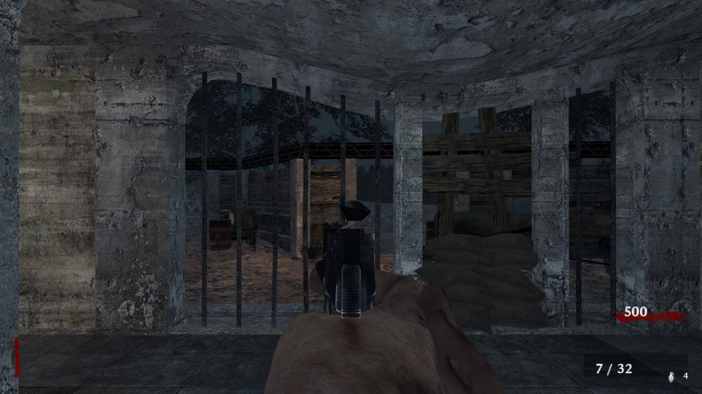
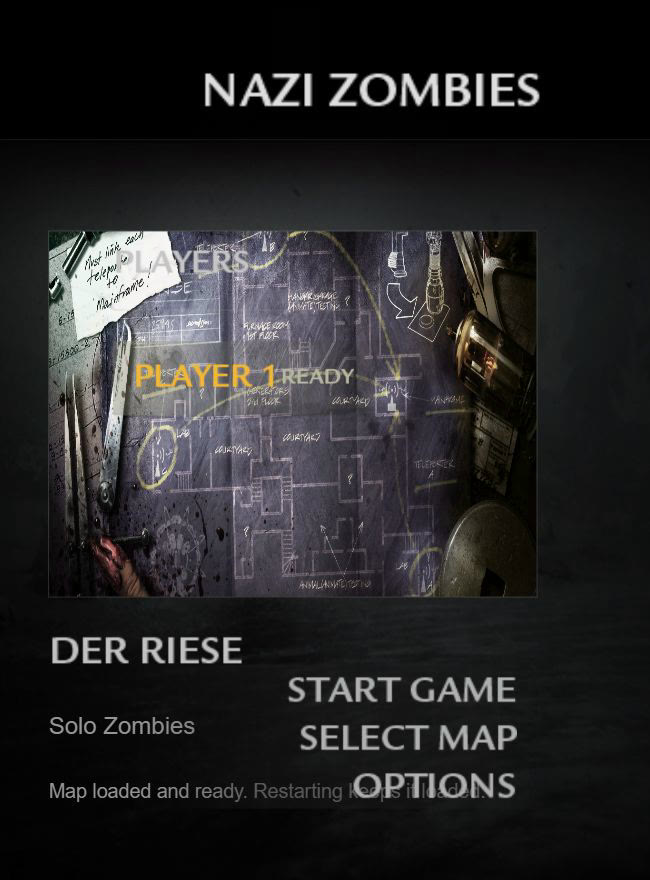
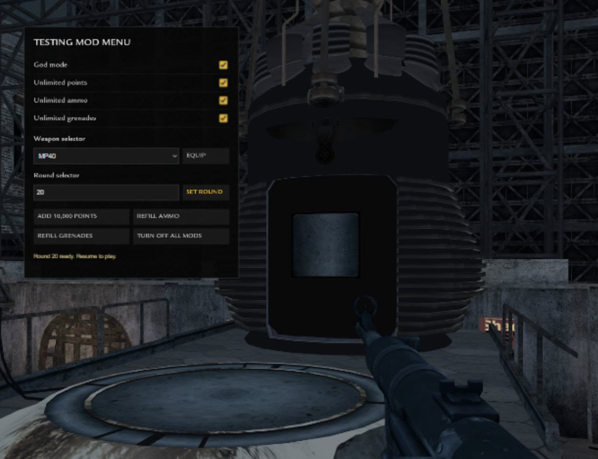
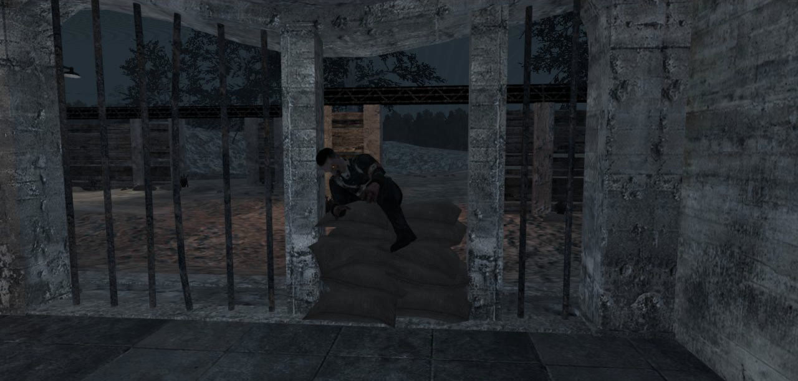
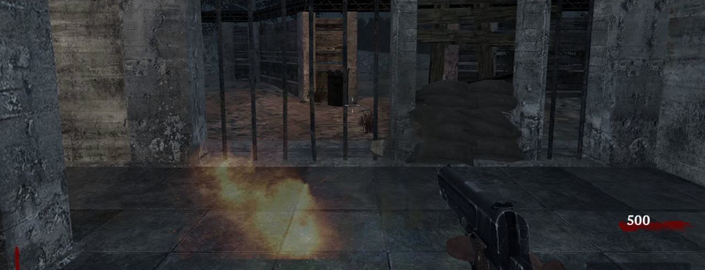
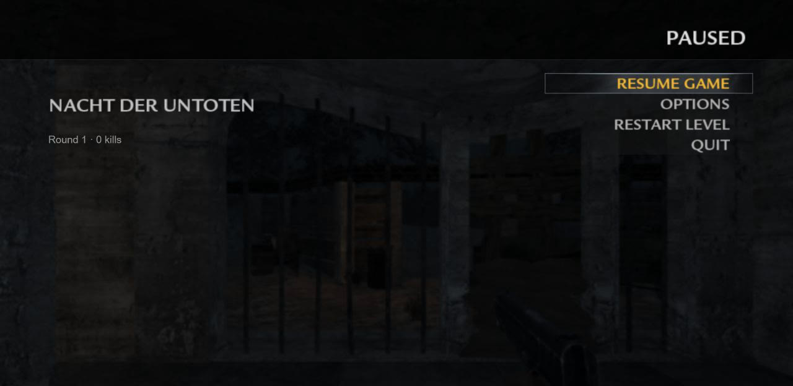

# CoD Zombies Web

A browser runtime for **Call of Duty Zombies**, with World at War, Black Ops and Black Ops II. It loads the original maps, models, textures, lighting, animations, sounds and HUD art from your own installed copies of the games and plays them in a desktop browser with [three.js](https://threejs.org/).

World at War has **Nacht der Untoten**, **Verrückt**, **Shi No Numa** and **Der Riese**. Black Ops adds **Kino der Toten**, **Ascension**, **Call of the Dead**, **Moon** and **Dead Ops Arcade**, using the installed game's original T5 maps and assets.

The collection opens each game's own themed lobby: **World at War** at `/world-at-war/`, **Black Ops** at `/black-ops/`, and **Black Ops II / TranZit, Buried and Nuketown Zombies** at `/black-ops-2/`. **ALL GAMES** returns to the collection; existing `?map=nacht` and `?map=der-riese` links still work.



> **Unofficial fan project.** Not affiliated with or endorsed by Activision or Treyarch. No game assets are included in this repository. You need a legally owned copy of the corresponding game and map DLC; the tools extract assets from your installation into a local, git-ignored folder.

---

## Contents

- [Screenshots](#screenshots)
- [Feature status](#feature-status)
- [Requirements](#requirements)
- [Game files used](#game-files-used)
- [Setup](#setup)
- [Playing](#playing)
- [Development](#development)
- [Project layout](#project-layout)
- [How it works](#how-it-works)
- [Credits and licences](#credits-and-licences)

---

## Screenshots

| | |
|---|---|
|  |  |
| **Zombies lobby** with the original map art and font | **Der Riese mainframe**, with the optional testing mod menu open |
|  |  |
| **Zombie climbing through a window** after tearing off the boards | **Grenade explosion** with the original effects |



*The WaW-style pause menu. Options include rebindable keys, mouse settings, sound and graphics. Some screenshots were captured during development, so a few HUD details differ slightly from the current build.*

---

## Feature status

### Dead Ops Arcade (Black Ops)

Select **Dead Ops Arcade** in the Black Ops map picker, or open `/black-ops/?map=dead-ops`. It has a separate overhead arcade engine; Kino retains its first-person engine. This implementation runs solo.

- Original `zombietron` world, all ten arena environments in their four-round order, character and enemy models, animations, seven arcade weapons, treasure/pickup models, HUD icons, 183 sound aliases and arena music. The original loading movie and audio play when Start Game is clicked, with streamed download progress and ready-only skip.
- WASD movement and mouse aiming/shooting; Space or the sprint binding spends a speed boost and the grenade binding (G by default) spends a nuke. Standard/mapped controllers use the left stick to move, right stick to aim and shoot, Jump to boost and Grenade to nuke, with controller button labels.
- Script-derived spawn groups, 32-enemy cap, one-hit life loss, respawn protection, extra lives, treasure multipliers, timed weapons (10 seconds of firing, consuming one fifth as quickly while idle), support pickups, exits, four fates, a round-40 Silverback encounter and repeating arena laps. Physical corpses and original pickup effects use bounded pools.
- BO1 pause/settings screens, testing menu with weapon/round selection, and shared named server saves, including the live enemies, bullets, treasures, timers, lives and chosen fate.
- Arena navigation is built on the host from native collision and includes only floor routes connected to the playable arena; floors and actors use fixed 120 Hz physics with interpolated rendering.

This is a browser reconstruction of Dead Ops, not execution of the native T5 binary. Online arcade co-op, the original scripted tutorial/intro, bonus-room layouts, arena-specific hazards/challenges and the full original Silverback AI are not implemented yet; special enemy behaviors, support weapons and the Room of Fate presentation are simplified. The full ten-arena asset pack is approximately 437 MiB compressed on its first download and stays in the browser's ordinary versioned cache.

Prepare with `npm run extract:doa` followed by `npm run prepare:doa`; verify with `npm run test:doa`. Extracted assets, navigation and packs stay under `local-data` and `.cache` on E: and are excluded from Git.

When rebuilding the local exporter from source, run `python -B tools/extend_doa_exporter.py` before `tools/build_exporter.ps1` so the shared T5 canine clips are exported into `bo1-doa-common` too.

The game is a JavaScript reimplementation. The original game scripts (`.gsc`) are not executed; their rules, numbers and timings are ported by hand and checked against the extracted scripts.

### Working: both maps

- **Original assets:** map geometry, baked lightmaps, textures, static and script models, weapons, viewmodel animations, sounds and HUD art, all loaded from your install.
- **Rounds:** original solo zombie counts, health scaling and spawn pacing, with up to 32 zombies alive at once. Spawning starts after the round-number intro (6.75 s on round 1, 0.5 s later), and each spawn waits the original `zombie_spawn_delay` (Nacht 3 s, Der Riese 2 s plus a network frame), shrinking 5% a round.
  - Nacht's script adds no solo bonus, so it caps at 24 per round.
  - Der Riese scales up, for example 60 zombies at round 20.
- **Zombie AI:**
  - Spawns at windows near the player.
  - Tears off boards and climbs in with the original animations.
  - Navigates using the map's own path nodes.
  - Each zombie walks, runs or sprints using the original movement roll and clips.
  - Zombies keep their spacing instead of stacking into one model.
  - Melee plays the original attack clips (Der Riese adds walking and running swipes). Damage lands only on each clip's `fire` notes while you are in reach, so backing off dodges a swing. 50 damage a hit; health returns 2.4 s after a hit, or after 5 s once in the red. Jugger-Nog raises max health to 160.
  - Footsteps, swipes and vocals play from each zombie on its animation notetracks. Der Riese adds death and "behind you" vocals.
- **Getting hurt:** the original `_gameskill` feedback: a fading blur on each hit, the `hit_direction` blood arc toward the attacker, and the `overlay_low_health` red pulse at 20% health or below.
- **Weapons:**
  - Original viewmodels, iron sights, recoil, reloads, sprint poses and knife.
  - Short knife lunges select a nearby living zombie in front, use native charge timing and stabbing clips, and gently center aim. Movement respects native player hulls, stairs, walls and window clips; close attacks keep the normal swipe. Melee hits share the blood effects.
  - Wall buys, and the mystery box with weapon cycling and a manual grab.
  - Gunfire uses the rendered map and prop triangles, so openings and transparent cutouts admit shots. Rebuildable window boards can be shot through; solid cover still blocks bullets.
  - Bullets can hit multiple living zombies along their path, using the original weapon penetration tier to approximate flesh penetration. Solid cover still stops the path.
  - Range damage blends from each original weapon's close damage to its far damage, then stays at its minimum. Shotguns retain their native pellet count and cone width, with a centered pellet and distributed spread for consistent close blasts. Animated head and torso combat volumes supplement mesh hits, so torn clothing and pose seams cannot make an otherwise valid hit miss. These mechanics are shared by WaW and Black Ops.
  - Grenades: cook them, throw them through windows, or pick up live ones and throw them back.
- **Zombie deaths:** shared skeletal ragdolls for WaW and Black Ops, with physical map contacts, fixed-step simulation and sleeping corpses in the prepared actor pool. Lethal headshots detach the original head rig into an independent physical head and expose the native gore stump, with the original head-gib sound. Hits create blood sprays and wall/floor splats using each game's original textures; five fixed GPU batches and bounded actor slots prevent effects from accumulating. All gore resets when an actor is recycled or a game is restarted.
- **Barriers:** rebuilt with the use key, awarding points with the original repair sound.
- **Power-ups:**
  - Max Ammo, Insta-Kill, Double Points, Nuke, plus Carpenter on Der Riese.
  - Original shuffled drop rotation.
  - Spawn sound and looping hum while a drop sits on the ground.
- **HUD:** chalk round tally with the white flash between rounds, score with +point popups, ammo, grenades, perk icons and a moving crosshair.
- **Lobbies:** co-op is opt-in, so you can always start a solo game, and a tab left open elsewhere can't block you.
  - Every browser that opens a map starts in its own private lobby.
  - The PLAYERS panel lists OTHER LOBBIES on the same map and server, each with JOIN.
  - INVITE A FRIEND / COPY INVITE LINK copies a `?lobby=` link that joins your lobby directly. Friends on your network need this computer's network address instead of `localhost`.
  - LEAVE LOBBY returns you to your own lobby.
  - A shared lobby holds up to 4 players and shows who hosts: the first player to arrive, passing on when they leave. It also shows whether each player is READY, LOADING, WAITING or IN GAME.
  - In Black Ops each player gets a different character.
  - Only the host can Start Game. Everyone in the lobby loads the map, players who finish first wait on the loading screen, and all of them go in together.
  - A lobby that is mid-game can't be joined.
  - Saves load only when you are alone in your lobby.
- **Online co-op:** a match started from a shared lobby is one game. The host's browser runs the world (rounds, zombies, doors, barriers, the box, power-ups, power and teleporters) and every other browser mirrors it, reporting its own hits, purchases and repairs; the host pays each player's points and kills. Zombies hunt the nearest player who is not down. Players start on the map's separate spawn markers, see each other's character, stance, dives, weapon and gunfire, and every player's score is listed above your own. Max ammo refills everyone, a nuke pays everyone 400 and a carpenter 200; the box weapon belongs to whoever paid. Zombies per round grow with the player count as in the original scripts. Last stand: lethal damage downs you with a pistol and a 30-second bleed-out; a teammate holds Use for 3 seconds (1.5 with Quick Revive) to revive you; bleeding out leaves you watching a teammate until the next round; the game ends when everyone is down. Co-op Quick Revive costs 1500 and no longer self-revives. The game keeps running behind the pause menu; Quit leaves the match. Players' browsers exchange state with the server about 25 times a second through ordinary requests, so it works through proxies. Teammates are solid: you cannot walk through a standing teammate, and their body stops your shots (friendly fire does no damage). Teammates are the original characters (Nacht's four Marines with their helmets and gear, Der Riese's and Kino's Dempsey, Nikolai, Takeo and Richtofen) animated with the games' own third-person player clips: idle, aiming, running and strafing in four directions, sprinting, crouching, prone crawling, diving and the last-stand crawl, with pistol variants, holding their current weapon. `tools/prepare_player_animations.py` (run by the build) exports those clips and lists each map's characters.
- **Step smoothing:** as in the original, stepping onto stairs, ledges and low props (up to the 18-unit step) moves the player instantly but the view glides over 0.2 s instead of popping.
- **Player stances:** crouch and prone in both games, with lower camera/shot/grenade origins, smaller collision hulls, slower movement and native weapon stance spread. Crouch uses C, prone uses Ctrl, and Stand/Jump uses Space. Standing up under low cover is blocked. Controller B/Circle taps crouch, holds prone; A/Cross stands before jumping. Rebind these in Options. Saves retain stance; older saves default to standing.
- **Dolphin dive (Black Ops):** Ctrl while sprinting, or hold B/Circle while sprinting, dives forward and ends prone. The physics are BlackOps.exe's own (the `dtp_*` dvar defaults and its dive code): the dive keeps the full sprint speed, launches at twice a normal jump's upward speed, holds at the 39-unit jump height until 400 ms after takeoff, then falls; on landing it slides without friction for 300 ms, stops, and movement resumes 100 ms later. That is about 7.3 m on flat ground. A dive needs 250 ms of sprinting and 1.5 s since the last dive ended; a long drop out of a dive does fall damage between 65 and 200 units. The weapon plays the gun's own dive clips and is ready again its `dtpOutTime` after landing. Walls shorten the path and ledges extend the fall. Landing and slide sounds follow the floor surface, with the stock launch/landing grunts, and an animated character body is posed for the dive. As in the original, you never see your own body in first person; it is shown only in the third-person debug view, ready for other players in a future co-op mode. WaW never dolphin dives. [The original PC manual](https://cdn.akamai.steamstatic.com/steam/apps/42700/manuals/BlackOps_PC_Manual_v2.pdf) documents the keyboard controls.
- **Audio:** 3D positional sound for machines, jingles, the PA system and pickups.
- **Pause menu:**
  - Rebindable keys (primary and secondary bindings, mouse buttons, wheel).
  - Controller support shared by WaW and Black Ops, with analog sticks, independent aim/fire triggers, grenade cooking, menu navigation and input-dependent button icons.
  - Mouse and aim sensitivity, invert, hold/toggle aim.
  - Volume, field of view, render scale, fullscreen.
  - FPS counter.
- **Menus:** each game's zombies menu matches the original as closely as possible.
  - **Sounds:** every menu plays its original hover, select and back sounds, with the lobby music looping until a game starts:
    - World at War: `mouse_over` / `mouse_click` and "Brave Soldat".
    - Black Ops: `uin_navigation_*` and `mus_zmb_mainmenu`.
    - Black Ops II: `cac_main_nav` / `cac_submenu_edit_sel` / `cac_cmn_backout` and "Damned 100AE".
  - **Black Ops:** the lobby sits in the frontend map's interrogation room, seen from the chair.
    - The room is graded by `zombie_frontend_menus.vision`'s red film.
    - The TV wall plays the frontend cinematic's zombie footage, bars and logos tile by tile, changing every few seconds as `frontend.gsc` does.
  - **Black Ops II:** the lobby floats in the zombies menu's space backdrop from `ui_zm.ff`: the sun and flares, drifting asteroid belts, the moon, and the lava-cracked globe slowly turning.
    - SELECT MAP moves the globe to the centre with each location's signpost pinned at its `mapstable.csv` coordinates.
    - Click a pin, or use the arrows or arrow keys, to spin the globe to a location (with the original globe spin and map switch sounds).
    - Locations not in this build are shown but can't be chosen.
  - `npm run prepare:menus` exports and converts all of this from the installed games.
- **Launching a map:** selecting a map opens its lobby without downloading the game pack. START GAME plays the installed game's original loading movie and soundtrack while downloading assets. The progress bar measures downloaded bytes, then completed preparation stages. Once the map is ready, SKIP INTRO starts immediately; otherwise it waits for the movie to end. Der Riese's original loading clip is a silent still frame and remains on screen while the map loads. Saved-game loading uses the same flow across both games. `npm run prepare:launch` converts the original movies on E:; the normal launcher also prepares them when necessary.
- **Loading audio:** split Bink speaker tracks are combined into one stereo soundtrack, including the centre dialogue, bass and rear channels. BO2's external left/right and centre stems use the same mixer. A limiter prevents clipping when channels combine. Audio-only fixes reuse the prepared H.264 video, and movie preparation stamps change the browser URL so refreshed pages receive the corrected soundtrack.
- **Save game:** three named server slots per map, shared by everyone who has access to the site, with no extra sign-in. Pause → SAVE GAME, enter a name, then choose a slot. Resume from LOAD GAME on any browser or device. Saves keep live zombies, round progress, drops, timers and map state, with thumbnail and statistics. Files live under `local-data/saves/` on E: and persist across server restarts; existing browser saves import into empty slots once. A changed slot rejects stale writes from another device; overwrites and deletions retain a recovery backup.
- **Character voices (Black Ops):** solo Kino plays as a random one of Dempsey, Nikolai, Takeo or Richtofen (add `&character=0`–`3` to pick), with that character's arms and voice. Lines follow `_zombiemode_audio.gsc`: kill types and their chances, kill streaks, weapon and favourite-weapon pickups, Pack-a-Punch, perks, power-ups, refused purchases, ammo warnings, going down and the level-start line. `npm run prepare:voice` rebuilds the voice files.
- **Testing mod menu:** choose MOD MENU from the pause menu. It has god mode, unlimited points, ammo and grenades, noclip (fly through walls: look to steer, hold Jump to rise, Sprint for speed), a weapon selector and a round selector.
- **Rendering performance:** the original engine's cell-and-portal visibility (DPVS) is exported with each map. Each frame starts in the view's cell and flood-fills through the portals it can see, so only those cells' world surfaces, static props and map entities are drawn. Static props also use their original cull distances. Add `?cells=0` to the URL to compare against drawing everything.
- **Network play:** other devices on your local network can connect. Each browser runs its own solo game.

### Working: Der Riese

- Lobby and map selection, power switch, doors and zone unlocking.
  - The power lever keeps its authored off pose and rolls upward over the original 0.3 seconds. Powered navigation routes are prepared before play to avoid a pause when the switch is used.
- **Perks:** buying one plays the machine's sting at the machine, then the original drink animation and sounds. The perk takes effect when you finish drinking.
  - Jugger-Nog, Speed Cola and Double Tap work.
  - Each machine plays idle jingles and electrical sparks.
- **Teleporters:**
  - Linking shows the original stopwatch and plays the PA countdown and announcements.
  - Linked pads teleport you to the mainframe.
  - Each link strikes lightning by the spawn fence and drops a power-up.
- **Pack-a-Punch:**
  - Opens after all three links.
  - Plays the knuckle-crack animation while your gun rolls into the machine.
  - The upgraded gun comes back out with a ticking timer; leave it 15 seconds and it's gone.

### World at War: Verrückt

Select **Verrückt** in the World at War map picker, or open `/world-at-war/?map=verruckt`. It runs on the WaW engine with the map's own rules (`web/waw-verruckt.js`), using the installed `nazi_zombie_asylum` fastfile, its patch and localized zone.

- **Start:** solo players start on a random side of the asylum (north or south of the power door), as `spawn_point_override` does.
- **Spawning:** rounds 1 and 2 hold six zombies solo.
  - Doors and debris add their own spawner groups.
  - The courtyard, upstairs and corner volumes switch spawners and windows on while you are inside them, checked every second (`manage_zone`).
  - Door-gated windows open with their door.
  - Courtyard risers (75%) climb out of the 32 `zombie_rise` spots and walk to one of the three windows nearest them.
- **Barriers:** the three stone wall breaks have 15 chunks each, with the stone break and rebuild sounds.
- **Power:**
  - The power switch is free. The lever flips and the electric traps come on.
  - About 6 seconds later, the perks power up and the middle divider slides open.
- **Perks:** Jugger-Nog, Speed Cola and Double Tap. WaW Quick Revive does not revive you solo.
- **Electric traps:**
  - Both traps cost 1000. Their lever swings, then the current runs for 25 seconds, followed by a 25-second cooldown and the PA warning.
  - Zombies caught in the current die without paying points.
  - Players are downed, or take 50 damage with Jugger-Nog.
- **Mystery box:**
  - Starts in the power room and costs 950.
  - The teddy bear can appear from the fifth use (uses + 3%), refunding the 950. The bear rises, the box lifts and vanishes, and rubble is left behind.
  - The box returns only in areas you have opened.
- **Not implemented yet:**
  - Bouncing Betties.
  - Ray Gun, Panzerschreck, flamethrower, rifle grenades and molotovs; the box offers the hitscan guns.
  - The toilet and dentist-chair easter eggs.
  - The lamps and zapper lights changing with power.
  - Burning trap deaths.
  - The intro text.

Prepare with `npm run extract:verruckt` then `npm run prepare:verruckt`; verify with `npm run test:verruckt`.

### Black Ops: Ascension

Select **Ascension** in the Black Ops map picker, or open `/black-ops/?map=ascension`. It runs on the same T5 engine as Kino with the map's own rules (`web/bo1-ascension.js`), using the installed `zombie_cosmodrome` fastfiles, its patch and English zones.

- Original cosmodrome geometry, lighting, collision, path graph, cosmonaut/scientist/Spetsnaz zombie art (one model in this pass), the crew's Ascension outfits, voice lines, sounds, `mus_cosmo_underscore` and the loading movie.
- Both start zones (`centrifuge_zone` and `centrifuge_zone2`), all eleven doors and their zone flags, 32 window routes and risers that climb out of each zone's rise structs (`level._zombie_rise_anims`). Zombie routing passes player clip but not monster clip.
- Power, Quick Revive, Jugger-Nog, Speed Cola, **Stamin-Up** and **PhD Flopper** (dive landings that would hurt explode for 1000–5000 within 300 units; no damage from your own explosives). The box at its eight locations uses the map's `include_weapon` list.
- **Lunar landers:** the intro ride from the sky to the centrifuge, call boxes (free, after power), 250-point rides from the pad to a random enabled station or back to the centrifuge, the original climb/cruise/descent timings and catwalk waypoint, gates, cleared pads, paused spawning and 30-second cooldowns.
- **Rocket launch and Pack-a-Punch:** riding from Base Entry, the Catwalk and Storage authorizes the launch panel; the countdown, liftoff and, 10 seconds later, the blast doors slide apart and join the rocket zones.

Not implemented yet: space monkey rounds, the centrifuge and fire traps, the Gersh device, Matryoshka dolls, sickle, crossbow/ballistic knife/launchers in the box, auto-turrets, the rocket lifter and claw animations, fog/vision changes and the easter egg.

Prepare with `npm run extract:ascension` then `npm run prepare:ascension`; verify with `npm run test:ascension`.

### Black Ops: Call of the Dead

Select **Call of the Dead** in the BO1 map picker, or open `/black-ops/?map=call-of-the-dead`. The installed `zombie_coast` map, patch and English fastfiles supply the snow-covered coast, ship and lighthouse, native lighting/vision grade, collision, navigation, 32 window routes, seven perk machines, models, sounds and celebrity voices/arms. The original loading movie plays with audio and measured download progress when Start Game is pressed. Prepared assets, movies and caches stay on E:.

The separate `CallOfDeadEngine`/`CoastRules` run BO1's rounds and combat with George's native model, club, animations and per-player health. Shooting makes him angry; water calms him. He does not count towards round completion, survives nukes, drops a free-perk pickup and a 30-second Death Machine when defeated, and returns after an absent round. The perk pickup rewards each living player. Water builds cold over 30 seconds, freezes controls and lets a teammate's shot break the ice. Pack-a-Punch follows the original lighthouse wait/search/rise/availability cycle and moves between the three native sites, keeping the machine and purchase point together. Original zipline landing points and the flinger provide approximate travel trajectories. The moving box, Sickle melee, Deadshot, travelling Ray Gun/V-R11 rounds and Scavenger's sticky three-second explosive bolt are supported alongside shared settings, controllers, gore, co-op and server saves.

This is a playable browser reimplementation, with approximate George pursuit, transport paths and projectile visuals. The main Easter egg, George's complete scripted attack/retreat choreography, native weather effects, Matryoshka Dolls, full upgraded V-R11 effects and VR-11 human lure behaviour remain pending. Live projectiles and the temporary Death Machine block saving until they finish. `npm run extract:cotd`, `npm run prepare:cotd` and `npm run test:cotd` prepare and perform a focused logic check; browser gameplay is user playtested.

### Black Ops: Kino der Toten preview

The dedicated T5 runtime uses Kino's original theater geometry, packed HDR lighting, collision, navigation, weapon rigs, animation clips and decoded sound banks. It implements BO1 round counts, wall purchases, mystery box cycling, perks, three solo Quick Revives, power and the linked teleporter's 30-second projection-room visit and automatic return. Native firearms include burst fire and Pack-a-Punch variants. The preview also has pause/settings, the testing menu and shared named server saves.

Zombies follow BO1's pacing (a 10.25 s intro before round 1, 2.5 s later, plus a 0.1 s network frame per spawn) and melee (60 damage on each attack clip's `fire` notes). `_zombiemode_audio.gsc` vocals play from each zombie: ambient or sprint loops, attack, teardown, death and behind-you lines, with `evt_player_swiped` and the original hurt overlay and blood arcs on hits. Zombies route through player clip but not monster clip, so every Kino window is used.

This is a browser reimplementation, not the original executable or complete BO1 engine. Hellhound rounds, Nova crawlers, traps, film reels, Mustang & Sally and full wonder-weapon projectile/effect fidelity are still pending. Ray Gun splash and the Thunder Gun cone currently use simplified combat behavior.

To prepare BO1 from the installed game on E: after installing the existing OAT toolchain:

```powershell
python -B tools/extend_bo1_exporter.py
& tools/build_exporter.ps1
python -B tools/extract_bo1.py
npm run prepare:bo1
```

Extraction, conversion, prepared packs and navigation remain under this project on E:. `npm run test:bo1` checks the native floor, ammo, rounds, interactions and sounds; `npm run test:saves` checks server persistence and sharing.

### Black Ops II: Buried

Buried opens from the collection into an orange and charcoal BO2 lobby and map selector. Its dedicated T6 rules run on the shared browser renderer and fixed-step movement/combat foundation. The original executable is not run in the browser.

The map uses the original T6 packed world geometry, three-layer HDR lightmaps, native collision, static models, doors, windows and 2,403 navigation nodes with 16,603 links. The exporter also reads T6 weapon definitions, character rigs, XAnim clips, material states, sound banks and Buried's original loading movie. Surfaces use T6's glow maps (the cell key, lamps, lit windows), compiled two-layer blends (ivy, hay, sand, burnt debris and stains over their base) and each material's native blend state for decals, glass and grates; T6 specular and reflections are not rendered yet. START GAME downloads a prepared pack with measured byte progress, prepares the scene, then waits for the movie or offers Skip Intro.

Survival includes T6 round counts and health scaling, spawning near occupied zones, factory descent with the start catwalk and floor collapsing on their original fxanims, town doors, original viewmodels and animations, wall buys, seven perk machines, power and Pack-a-Punch. The mystery box uses Buried's own weapon list and zbarrier open/close/leave/arrive animations; after enough uses the teddy bear refunds the spin and the box moves to another location (the maze locations once the maze is reached). Buried rules add Arthur from the original sloth script: unlock his cell with the key (a held use with the builder hands) and he cowers as the door swings open; carry booze or candy and he follows and asks for it; give it while facing each other. Booze makes him drink, turn and charge, breaking the barricade he hits; candy makes him guard you for 45 s. Also included are six placeable weapon chalks, the bank and weapon locker, mansion ghosts and a free perk. Buildable parts can be assembled at free benches into a Turbine, Trample Steam, Head Chopper or Subsurface Resonator. Equip one and use **5 / controller D-pad Up** to place it; Use retrieves it. Bindings can be changed in Options. The Resonator needs a nearby Turbine.

Zombies rise with T6's `zm_rise` clips for their speed and spawn at most 24 alive. They are voiced by `_zm_audio.gsc` (louder vocals for the last zombie, network-safe limits) and swipe for 60 on their attack clips' `fire` notes. Hits play `evt_player_swiped` and the character's pain exert, with the original hurt blur, `hit_direction_zm` arcs and low-health overlay.

Ray Gun, Ray Gun Mark II and explosive weapons use traveling projectiles, native damage and splash values. The Paralyzer's counter climbs to 115 over 10 s of firing and unlocks at 100; it slows, hovers and has a damage cone. Shared grenade cooking, stance/dive controls, gore, pause/options, testing menu and named server saves also apply to Buried. Saves keep chalks, Arthur, bank/locker, the box location, maze gates and built/placed equipment.

This is a playable survival port under development, not complete stock BO2 parity. Easter-egg quests, the Time Bomb, persistent upgrades, dual-wield presentation, chalk drawing visuals, upgraded melee viewmodels, Vulture Aid's gas and through-wall markers, full native wonder-weapon effects and parts of Arthur remain unfinished: he doesn't react to being shot or go back to his cell, has only the protect candy task (not moving the box, building or fetching), and doesn't use the mansion route. Mystery box fire sales, the box's away-piece twitches and limited-weapon counts aren't implemented yet; dual-wield Five-seven, monkeys, the ballistic knife and the Time Bomb are left out of the box. Solo survival is the tested mode. In co-op, guests see Arthur, the cell and the box, but only the host can unlock the cell, give Arthur items or build at benches for now. Some equipment and ghost behaviors are approximations. The initial map pack is about 500 MiB compressed and is cached after download.

To extract the installed game and prepare Buried on E: using the existing OAT toolchain:

```powershell
python -B tools/extend_bo2_exporter.py
& tools/build_exporter.ps1
python -B tools/extract_bo2.py
npm run prepare:bo2
npm run test:bo2
```

`tools/decompile_bo2.py` optionally produces local script references using gsc-tool. Those scripts stay under ignored `local-data/bo2-scripts/` and are not served or packaged. All extraction, navigation, cache and prepared asset output remains under this project's directory on E:.

### World at War: Shi No Numa

Select **Shi No Numa** in the World at War lobby, or open `/world-at-war/?map=shi-no-numa`. The owned `nazi_zombie_sumpf` fastfile, localized sounds and patch provide the world, baked lighting, Japanese zombie/head/gore models, both native Hellhound models, weapons, clips, 19 barriers and 3,670 path nodes. The film pass uses `zombie_sumpf.vision`, and native screen-blended light shafts remain transparent. Its four-frame loading BIK loops with the original splash-screen soundtrack while the measured pack loads. Assets, navigation, logs and caches remain on E:.

Purchase the stairs/debris, the four 1,000-point paths and 750-point hut doors. Spawns follow occupied building/outdoor volumes. Each hut reveals one of four randomized perk machines through the native timed lottery; solo's first hut offers Jugger-Nog or Speed Cola. WaW Quick Revive helps teammates and does not revive solo players. The moving Mystery Box includes the native hitscan weapons, Ray Gun and Wunderwaffe DG-2. Ray Gun shots travel and explode; Wunderwaffe shots chain through nearby unobstructed enemies, with the script's arc cutoff and 20-enemy limit.

Hellhound rounds first occur on rounds 5–7 and repeat 4–5 rounds later. They use native dog movement/attack clips, lightning spawn protection, the original intro sounds, health tiers 350/700/1,000/1,250, two live dogs per player, six dogs per player for the first two dog rounds and eight afterward, and one Max Ammo from the final dog. The Flogger costs 750, spins for 30 seconds and cools for 45; hut electric traps cost 1,000, run 25 seconds and cool for 90. Trap kills give no points. Activate the Fishing Hut zipline lever, then spend 1,500 to ride or recall the cage along its native 28-node route, with a 40-second cooldown. Saved matches retain perk placement/reveals, dog scheduling, trap timers, projectiles and a mid-flight zipline rider.

The port reconstructs the scripts rather than executing the original engine. Flogger damage uses an approximate swept danger volume; zipline motion, fog height, projectile effects and dog movement around obstacles are approximations. Bouncing Betties, Molotovs, flamethrower/launcher equipment, radio/song quests and the falling bridge event remain pending. Run `npm run extract:shi-no-numa`, `npm run prepare:shi-no-numa` and `npm run test:shi-no-numa`. The map test covers the shipped asset pack, 30–240 FPS spawn support, native door/perk progression, dogs/Max Ammo, the Flogger, zipline/rider saves, chain limits and moving-object bullet collision. Restart the server after adding a map to register it with the save/lobby APIs.

### Black Ops: Moon

Select **MOON** in the Black Ops lobby, or open `/black-ops/?map=moon`. Its installed fastfiles provide the world, baked lighting, collision, 2,003 path nodes, 17 zombie windows, lunar actors, weapons and animations. Start Game downloads the measured asset pack and plays the original Moon BIK with its stereo soundtrack. Data, packs, navigation, test logs and caches stay on E:.

Start in No Man's Land, survive its 25-second sprint transition and use the Earth teleporter to reach Griffin Station. No Man's Land uses supported native riser/chaser markers and never falls back to window spawning; an invalid marker is skipped rather than stopping the game loop. Lunar play includes low gravity, pressure volumes, oxygen/suffocation, the P.E.S. pickup/equip gesture, purchased sliding airlocks, power, perks, the Mystery Box, Area 51 Pack-a-Punch, jump pads, the astronaut's perk-stealing headbutt, basic Nova crawlers and the three excavators with Hacker panels. Press **5** to equip/remove the P.E.S. and **4** to combine/split the Zap Guns and Wave Gun. Default controller equivalents are D-pad Up and D-pad Left; both actions can be rebound. Taking the Hacker replaces the P.E.S. Airlock hacking costs 200 points and takes 32.7 seconds; excavator hacking takes five seconds and awards 1,000 points. Named server saves retain Moon/Earth round state, equipment, atmospheric breaches, airlocks, excavators and weapon-mode ammo.

This is a browser reconstruction. The full Easter egg, Gersch Devices/QEDs, Mule Kick machine placement, No Man's Land Hellhounds, Nova crawler phasing/gas, independent left Zap Gun firing and some original effects remain unfinished. Excavator and jump-pad trajectories, atmospheric lighting and No Man's Land difficulty timing are approximations. Moon co-op has not been playtested.

Run `npm run extract:moon`, `npm run prepare:moon` and `npm run test:moon`. Complete the preparation before running the map test: it needs the finished door-state navigation. Coverage includes packed model/texture/animation dependencies, native geometry, Earth/lunar floors and jumps at 30–240 FPS, more than 80 seconds of No Man's Land, invalid-marker handling, all 52 prepared window approaches/traversals at gait extremes, oxygen/P.E.S., progression, weapon modes and kills, the astronaut, excavators, jump pads, crawlers and saved state. Browser checks cover actual loading, gameplay and map interactions; automated browser testing uses Chromium, not Firefox.

### Black Ops II: TranZit

Select **TRANZIT** on the BO2 globe, or open `/black-ops-2/?map=tranzit`. Classic Green Run runs on the shared T6 engine with separate `TranzitRules`. Its original world, location fastfiles, baked lighting, collision, 38 window barriers, 50 spawn volumes, weapons, viewmodels, voices and character bodies come from the installed files. Start Game loads the measured asset pack and original TranZit artwork/underscore; this installation has no TranZit loading video. Extraction, caches and prepared assets remain on E:.

The native bus and animated T.E.D.D. follow the authored 278-node loop through Bus Depot, Diner, Farm, Power Station and Town, with the original 40–180 second stop range, horn, motor and driver recordings. Use opens its doors and boards/exits near either doorway. Riders can move inside a simplified interior hull; the platform turns their view with the bus. Native animated bus geometry governs shots through the doors/windows. Ordinary zombies use the occupied zones, barriers and prepared navigation. Fog gets denser on the connecting roads; native lava volumes damage the player. Denizens attach in the fog and can be knifed off. After power, an approximate Avogadro encounter ignores bullets, nukes and Insta-kill and takes four knife hits or two Galvaknuckle hits.

Scavenge one part at a time and hold Use at its matching workbench. Supported assemblies are the Turbine, power switch, Pack-a-Punch, Zombie Shield, turret, electric trap and bus plow/hatch/ladder attachments. A Turbine locally powers electric doors and perks; one placed at the power-station hatch opens the bank's PAP access after main power. Explosives open the vault doors. Turret/trap damage requires a nearby Turbine. The Shield blocks rear zombie swipes, and the bus plow kills zombies ahead of it. Four-perk purchases, solo Quick Revive, Stamin-Up, Double Tap II, Mystery Box/Fire Sale, weapon upgrades, shared controls and named server saves use the common systems. Saves preserve the moving bus/rider, part choices, built items and placed equipment. In co-op, the host assembles buildables while clients can ride the shared bus and buy their own perks.

This is a playable reconstruction with approximate bus interior/door motion, Denizen and Avogadro choreography/visual effects. Full bus-window climbing attacks, roof/ladder traversal, Denizen lamp teleports, Tombstone recovery, Jet Gun assembly, EMP/monkey/Claymore/Semtex equipment and the Easter eggs remain pending. The bank and weapon locker use their native entities where present; balances are per saved match, not a separate persistent native profile. Native T6 map effects are not yet fully exported. Prepare with `npm run extract:tranzit` and `npm run prepare:tranzit`; `npm run test:tranzit` checks the shipped model/material/texture pack, floor/spawn, spread, parts/power, all five bus stops, rider collision and save restoration. Fire Sale uses the original BO2 pickup exported from Nuketown or Buried because TranZit's fastfiles omit it.

### Black Ops II: Die Rise

Select **DIE RISE** on the BO2 globe, or open `/black-ops-2/?map=die-rise`. Classic (rooftop) Die Rise runs on the shared T6 engine with separate `DieRiseRules`. Its original world, baked lighting, collision, 51 window barriers, 32 zone volumes, navigation and native traversal clips, weapons, viewmodels, voices, Chinese civilian zombies and leapers come from the installed `zm_highrise` fastfiles. Start Game plays the original loading movie and its music.

The seven perk elevators follow `zm_highrise_elevators.gsc`. Quick Revive rides car 1b; Who's Who and Speed Cola are split between 1c and 1d; Mule Kick, Jugger-Nog, Double Tap II and Pack-a-Punch are shuffled across the blue building's four cars. The cars wait for the power, except solo Quick Revive. Each visits its authored stops in script order at 100 units/s, with the native 5–20 s waits (15–25 s for Quick Revive), the 5 s departure delay, the alarm before returning to stop 0 and early departure after 5 s aboard. The Pack-a-Punch car holds while a weapon is upgrading. The cars and the escape pod are moving solid platforms: you can ride inside them or on the roofs, and a descending car crushes anyone below it. Shaft paths only open to zombies while a car is at that floor.

The escape pod drops to the ground floor once you have stood in it for 3 s. Bring it back with the elevator key from one of its 11 ground-floor spots. The same key, at an elevator console, calls that car to its floor. Trample Steam and the Sliquifier are built from one native candidate per part. The Sliquifier is taken once and then joins the Mystery Box; its goo kills zombies on impact and while they walk through it (24 s, 36 s upgraded). Leaper rounds start on round 5–7 and recur every 4–5 rounds. They spawn six leapers per player, at most two alive per player, with 400/900/1300/1600 health, and end with a Max Ammo. Kill volumes, `zombie_fell_off` volumes and the one-way zone links follow the map script. Each `spawn_location` attacks the barricade its `script_string` names; `find_flesh` spawns hunt straight away. The leaning towers' creased floor meshes catch a swept hull, so Die Rise follows its authored node links along the floor: a step holds while the floor continues and nothing stands at chest height, and otherwise the physics walk takes over.

Approximations: Who's Who in solo leaves your body and moves you to another zone's respawn point with only a pistol; using the body within 45 s restores your loadout and the other perks. It is not the full clone. Leapers chase and use the zombies' traversals; their wall runs, ceiling emerges and building leaps are not recreated. Zombies do not climb onto elevator roofs. The bank, weapon locker, the side quest and the elevator door animations remain pending. Prepare with `npm run extract:die-rise` and `npm run prepare:die-rise`; `npm run test:die-rise` checks the model pack, rooftop floor, perk placement, elevator stops/riders/collision, the escape pod and key, the Sliquifier, leaper rounds, Who's Who and save restoration.

### Black Ops II: Nuketown Zombies

Select **Nuketown** on BO2's globe, or open `/black-ops-2/?map=nuketown`. The map runs on the shared T6 movement, combat, controller, projectile, ragdoll and save systems, with separate `NuketownRules`; Buried's Arthur, mansion and buildable rules do not participate.

The installed `zm_nuked` map and patch provide the geometry, native material blends and lighting, collision, navigation, CIA/CDC player rigs, hazmat zombie models, original sounds, weapon definitions and animation clips. Both cul-de-sac zones start enabled; purchased doors enable their connected rooms and native ground-rise spawners. Authored negotiation links let zombies mantle, jump and crawl through the garage using the native animation clips; the traverse trajectory is an approximation between the authored endpoints. Nuketown has no repairable window barriers in these entities. The live zombie cap is 24.

Power starts on. Five machines are assigned to distinct original landing spots each game. Solo Quick Revive arrives first; the other machines are chosen at random after rounds in the original ranges (3–4, 6–8, 10–13, 15–18, 20–24), with the script's additional delays. Machines follow their authored vehicle-node paths and activate on landing. They include Jugger-Nog, Speed Cola, Double Tap II, Quick Revive and Pack-a-Punch. A save preserves machine placements, arrival schedules and an in-flight machine.

The mystery box starts at either original starting location and uses Nuketown's supported native weapon list, including the M27 and LSAT. Fire Sale opens all five boxes for 10-point spins for 30 seconds. The population sign and clock track kills, and newly spawned zombies have the native blue-eye head from round 25. Bowie Knife and Galvaknuckles apply their original melee damage; their special viewmodel presentation remains pending.

The installed Nuketown release has no loading WEBM. Its launch presentation uses the original Nuketown menu artwork and extracted Nuketown underscore, with the shared measured download progress and ready-only skip button. Assets download when Start Game is pressed, about 368 MiB compressed on the first visit, and remain under ignored `local-data/` and `.cache/` on E:.

Still unfinished: Semtex, monkeys, claymores, ballistic knives and dual-wield Five-seven, the bunker/Moon audio and easter eggs, the original rocket game-over cinematic, multiple zombie body variations, full landing dust/debris effects, and stock announcer switching. The ammo shed's cycling powerup is not yet recreated. This is a browser reconstruction, not execution of the native game.

Prepare with `npm run extract:nuketown` and `npm run prepare:nuketown`. `npm run test:nuketown` is a small logic check covering native spawn support, risers, perks, saves and Fire Sale; visual and sustained gameplay testing is separate.

### WaW: in progress or not yet implemented

| Area | Status |
|---|---|
| **Ray Gun / Wunderwaffe DG-2** | Not implemented yet. Their weapon files are extracted, but projectile, splash and chain-lightning behaviour is still to do. |
| **Hellhounds** | Not implemented. When the teleporter drop would send a hellhound, nothing appears instead. |
| **Der Riese extras** | Electric traps, monkey bombs and Bouncing Betties are not implemented. |
| **Der Riese spawns** | Three roof/drop zombie spawns are disabled because their traversal isn't supported yet. |
| **Teleporting** | Teleporting doesn't yet kill zombies around the pad as the original does. |
| **Quick Revive** | Can't be bought solo, matching WaW, where it only speeds up reviving teammates. |
| **Effects** | Lightning "trail" elements are drawn as camera-facing sprites rather than true ribbons. |
| **Sound ranges** | The extracted sound definitions have no min/max distances, so hearing ranges are chosen per sound type. |
| **Saves** | Can't save mid-drink, during Pack-a-Punch, with a grenade in hand or during a burst. Save after the action finishes. |
| **Multiplayer** | Online co-op for up to four players on the same server: opt-in pre-game lobbies (join from the list or an invite link), the host runs the match, and downed teammates enter last stand (30 s bleedout, revivable, back next round). Solo has no last stand: going down ends the game. Teammates' grenades and original muzzle-flash effects aren't shown yet. |
| **Other maps** | Additional Black Ops / Black Ops II maps remain pending. |
| **Setup automation** | Der Riese extraction isn't scripted yet; see [Setup](#setup). |

---

## Requirements

| Software | Notes |
|---|---|
| **Windows 10/11** | The extraction tools and helper scripts are Windows-specific. |
| **Call of Duty: World at War** | Installed through Steam or similar. You must own it. |
| **Node.js** | Runs the game server and tests. Developed and tested with 25.9. |
| **Python 3** | Runs the extraction and preparation scripts. Tested with 3.14. |
| **FFmpeg** | Must be on `PATH`. Converts audio and images. Tested with 8.1. |
| **Git** | Fetches the OpenAssetTools source. |
| **Visual Studio Build Tools 2026** | Needs the C++ desktop workload. Only used to build the custom asset exporter. |
| **A desktop browser** | Chrome, Edge or Firefox, with keyboard and mouse. |
| **Disk space** | About 4 GB for the extracted assets, tools and caches. |

---

## Game files used

The tools read these files from your game folder (for example `…\steamapps\common\Call of Duty World at War`). They never modify them.

| File | Used for |
|---|---|
| `zone/english/code_post_gfx.ff` | Menu and HUD fonts and images |
| `zone/english/common.ff` | Shared models, animations, weapons, effects and sounds |
| `zone/english/nazi_zombie_prototype.ff` | Nacht der Untoten: map, scripts and assets |
| `zone/english/nazi_zombie_factory.ff` | Der Riese: map, scripts and assets |
| `zone/english/localized_nazi_zombie_factory.ff` | Der Riese: localized strings and assets |
| `main/*.iwd` | Image and sound archives |

The extracted output goes to `local-data/`, which is git-ignored and should never be committed or shared.

---

## Setup

> The default game location in the scripts is `E:\SteamLibrary\steamapps\common\Call of Duty World at War`. `extract_game.py` and `prepare_gameplay.py` accept `--game-dir`. `prepare_fidelity.py` and `prepare_der_riese.py` currently hardcode the path in a `GAME` constant, so edit that line if your game lives elsewhere. `.npmrc` also pins npm's cache to this project's original folder; change or remove its `cache=` line on another machine.

**1. Clone the repository**

```bash
git clone https://github.com/CallMeBrado/cod-zombies-web.git
```

**2. Download the tools.** This downloads Premake 5.0.0-beta8 (checksum-verified) and OpenAssetTools v0.33.0. It also clones the OpenAssetTools source at a pinned revision, applies this project's exporter patch, and installs the npm dependencies.

```powershell
powershell -ExecutionPolicy Bypass -File tools\setup_tools.ps1
```

**3. Build the custom asset exporter**

```powershell
powershell -ExecutionPolicy Bypass -File tools\build_exporter.ps1
```

**4. Extract and prepare Nacht der Untoten.** This also runs the inspection, world verification and gameplay preparation steps.

```powershell
python -B tools\extract_game.py --game-dir "D:\Games\Call of Duty World at War"
```

**5. Der Riese (manual for now).** `tools/prepare_der_riese.py` builds Der Riese's gameplay data. But it expects `local-data/der-riese` to already contain a full extraction of `nazi_zombie_factory.ff`, and that extraction step isn't scripted yet. Automating it is the next setup task.

**6. Start the game**

```powershell
npm start
```

Then open **http://127.0.0.1:8789** and choose **World at War**. On Windows you can double-click **`Play Zombies.cmd`** instead: it prepares the map packs, starts the server in the background and opens your browser.

The first load downloads and caches the map packs (roughly 100 MB for Nacht and 150 MB for Der Riese, compressed). After that, reloads take a couple of seconds.

---

## Playing

In the lobby, choose **SELECT MAP**, pick a map, then **START GAME**. You start with a Colt M1911, 500 points and four grenades.

### Default controls

Every binding can be changed under **Esc → Options → Controls**.

| Action | Key |
|---|---|
| Move | W A S D |
| Look | Mouse (arrow keys also work) |
| Fire / aim | Left mouse / right mouse (or F to fire, X to toggle aim) |
| Sprint / jump | Shift / Space |
| Reload | R |
| Knife | V |
| Grenade | G (hold to cook, release to throw) |
| Switch weapon | Q or mouse wheel |
| Use, buy, rebuild, pick up a grenade | E (hold E at a window to rebuild) |
| Pause | Esc |
| Testing mod menu | Pause, then choose MOD MENU |

If the browser releases the mouse (after Esc or switching windows), click the game to capture it again.

### Local network play

The server listens on all network interfaces at port **8789**. Other computers on your network can open `http://<this-PC's-address>:8789/`; the launcher prints the address. Each browser plays its own solo game.

These environment variables apply when starting with `npm start`. `Play Zombies.cmd` always uses port 8789.

| Environment variable | Effect |
|---|---|
| `HOST=127.0.0.1` | Only this PC can connect. |
| `PORT=9000` | Use a different port. |

If Windows Firewall is enabled, allow inbound TCP on that port for `node.exe` on your local network.

### Settings and saves

Settings and key bindings remain specific to each browser. Game saves are stored on the server under `local-data/saves/`, so the same named slots appear on other devices. Everyone who can access the site shares them; no additional sign-in is needed. Back up that folder to preserve the saves. The old browser saves are retained locally and imported into empty server slots once.

### Controllers

Connect an Xbox, PlayStation, Backbone or other controller and press a button while the game tab is visible. Controllers reported by the browser with the standard mapping work immediately. Button icons follow the active input: Xbox letters, PlayStation symbols, Nintendo labels or generic button numbers. Mouse movement, clicks or keyboard input switch back to keyboard prompts. Disconnecting an active controller pauses the game.

Default controls: left stick moves; right stick looks; LT/L2 aims; RT/R2 fires; A/Cross stands/jumps; B/Circle taps crouch and holds prone (hold while sprinting to dive in BO1); X/Square reloads or uses nearby objects (hold to repair barriers); Y/Triangle switches weapons; RB/R1 throws a grenade (hold to cook); LS/L3 toggles sprint; RS/R3 knifes; Menu/Options pauses and resumes. Use the D-pad or left stick to navigate menus, A/Cross to select and B/Circle to go back. LB/L1 and RB/R1 cycle settings tabs.

**Options → Controller** contains stick sensitivity, aim sensitivity, deadzones, inverted look, hold/toggle aim, icon style and per-device button/stick remapping. Unmapped controllers need a one-time setup there: map the controls, release all buttons/sticks, then choose **USE THIS MAPPING**. Settings are saved in that browser, independently of keyboard bindings.

Use HTTPS (or `http://localhost:8789` on the server PC); browsers can restrict [Gamepad API access](https://developer.mozilla.org/en-US/docs/Web/API/Navigator/getGamepads) on plain HTTP network URLs. Firefox exposes devices after a controller interaction while the page is visible. If browser audio is not unlocked yet, click START GAME once; controller input can then handle the remaining launch and gameplay controls.

---

## Development

```bash
npm test                 # Full suite: startup, gameplay, physics, weapons, saves, powerups, routes
npm run test:der-riese   # Der Riese progression, perks, teleporters, Pack-a-Punch and all spawn routes
npm run test:controllers # Input switching, mappings, menus, triggers and analog movement at 30–240 FPS
npm run test:coop        # Host and guest Kino games through the relay: shared zombies, kills, doors, power, revive, game over
npm run test:lobby       # Lobbies: private by default, join/leave/invite, characters, host-only start, load-in together, timeouts
npm run test:movement    # Crouch/prone, low cover, saves, controller tap/hold and native BO1 dives
npm run test:dive        # Native trajectory/recovery, cooldown, ledges, collision events, grunts and character rigs
npm run prepare:map      # Rebuild both maps' preload packs and zombie navigation
```

For new maps, run the map's asset/gameplay checks and the relevant shared regression suite, then test loading, starting a round, movement, firing/reloading, spawning and map-specific interactions in the browser before handoff. A quick logic pass alone is not sufficient for map additions.

The route tests run zombies from every spawn at every gait speed the map uses, through the windows and to the player. Any stuck route fails the suite.

The dive settings are in `web/dive-config.js`, in world units and seconds. In the local developer console, `wawPreview.configureDive({ jumpHeight: 39, maxApexSeconds: 0.4 })` changes them for later dives. `wawPreview.diveTelemetry()` reports takeoff position, launch speed, peak rise, touchdown/stop distance, airborne/slide duration, movement/weapon-ready times and launch/landing counts. `wawPreview.setDiveThirdPerson(true)` shows the character pose; set it to `false` to restore the first-person view. `npm run prepare:dive` converts the owned stock sound layers and prepares body dependencies on E:. Shared exertion recordings are used by default; the profile table can map character-specific banks when matching recordings exist. No unique per-character dive recordings are assumed.

After changing collision or movement code, run `npm run prepare:map` to rebuild the prepared zombie navigation, then run both test commands.

---

## Black Ops: Shangri-La

Select Shangri-La on the main server at `/black-ops/?map=shangri-la`.

Shangri-La uses the owned BO1 `zombie_temple` map, patch, models, animations,
lightmaps, audio, and loading movie. Select it in the Black Ops map menu.
The browser rules include both power levers, constrained randomized perks,
the solo/co-op pressure plates and 60-second Pack-a-Punch stairs, minecart,
water slide, Napalm Zombies, Shriekers, power-up monkeys and the 31-79 JGb215.
Progression and active rides are included in server saves.

Run `npm run extract:shangri-la`, `npm run prepare:shangri-la`, then
`npm run test:shangri-la`. The shared BO1 common/base/UI exports must already
be present. Generated assets remain on E: and outside Git.

For simultaneous map development, use a separate checkout and launch its
server with `PORT=8791` and `ZOMBIES_SHARED_ASSETS` pointing to the existing
project. That setting reads existing public assets/packs while saves, lobbies,
runtime files and all newly generated assets stay in the preview checkout.
The live server can keep running throughout extraction and testing.

This is a reconstructed browser port. The water slide follows a centerline
from authored gallery markers rather than the native gravity script; the
minecart follows the original nodes with simplified speed/return timing.
One waterfall barrier uses an authored exterior path node as its riser start
because its distant native spawns require unsupported traversal animations.
Napalm explosion visuals reuse the exported native grenade effect; their
remaining ground fire uses native flame artwork with a reconstructed emitter.
The eclipse/EE quest, mud slowdown, spike traps and water-wheel machinery
are not fully implemented. These limitations do not prevent round play.

## Black Ops II: Origins

Select Origins in the Black Ops II map menu, or open
`/black-ops-2/?map=origins`. This first playable build uses the owned `zm_tomb`
map, original characters, Mauser C96, weapons, models, animations, lightmaps,
sounds and loading movie. The movie includes both the music/effects and
English dialogue stems mixed to stereo. Assets load only after Start Game.

Implemented: round play, native barrier routes, doors and local spawns, six
generator captures, local perk power, all-six-generator Pack-a-Punch, the
Origins mystery box, mud slowdown, shovel/dig spots, records and gramophone,
excavation access, Crazy Place portals and a first Panzer implementation.
Map progression and live special enemies are included in named server saves.
The normal testing menu includes Origins weapons and staff variants.

This is an **in-development reconstruction**, not a complete Origins port.
The giant robots, tank, shield/Maxis Drone, generator attacks, Easter egg and
staff upgrade quests are not implemented. Wind parts in robot heads are not
yet obtainable through normal play. Staff assembly and basic elemental
attacks are present for testing; charge attacks, snow-dependent digging,
golden-shovel rewards and parts from the plane/tank are unfinished. Wunderfizz
uses an immediate random perk selection, and the Panzer has simplified
armor/flamethrower behavior without the claw attack. Animated weather and
the vista's scrolling smoke shader are also unfinished. These limitations do
not prevent standard rounds, generators or Pack-a-Punch.

To reproduce the assets, apply `tools/extend_origins_exporter.py` **after**
`tools/extend_bo2_exporter.py`, then rebuild the local OAT Unlinker. Origins
requires the `dlczm4.ipak` lookup and its staff/map effect exports. Run
`npm run extract:origins`, `npm run prepare:origins` and `npm run test:origins`.
Shared BO2 exports and the prepared Buried base must already be present.
Assets, preload caches, scratch files, logs and saves stay on E: outside Git.

The Origins tests check the shipped asset pack, 30–240 FPS floor stability,
three complete starting-room rounds, generator timing/decay and local power,
doors, Pack-a-Punch, excavation items, portals, Panzer spawning, full session
restore, HTTP routes, stereo media, named saves and lobby registration.
Staff assembly tests supply parts as a fixture; they do not claim the
unfinished collection quests work end to end. Browser smoke checks cover
loading/skip, firing/reloading, movement and map interactions.

## Project layout

```
web/                 Browser runtime: rendering, game rules, AI, HUD, menus, audio
  game.js            Core solo game: rounds, zombies, weapons, power-ups, saves
  map-rules.js       Der Riese: power, perks, teleporters, Pack-a-Punch, PA system
  collision.js       Swept-box collision against map brushes and model triangles
  main.js            Scene setup, rendering loop and event wiring
tools/               Extraction, preparation, server and test scripts
  serve.mjs          Static server for the runtime and map packs
  build_preload.mjs  Bundles each map's assets into cached packs and prepares navigation
  oat-web-world.patch  OpenAssetTools exporter patch (maps, collision, effects, sounds)
  test_*.mjs         Automated tests
docs/                Screenshots and the development log
local-data/          Extracted game data (git-ignored, never commit)
```

---

## How it works

1. **Extraction:** a patched [OpenAssetTools](https://github.com/Laupetin/OpenAssetTools) exporter reads the game's fastfiles and IWD archives. It writes maps, collision, models (GLB), animations, effects, sounds and textures into `local-data/`.
2. **Preparation:** Python scripts read the original map entities and zombie scripts and produce gameplay manifests: weapons, round rules, spawners, barriers, perks and teleporters.
3. **Packing:** `build_preload.mjs` bundles each map into compressed, cacheable packs and precomputes zombie navigation.
4. **Runtime:** the browser loads a map pack, renders it with three.js using the original lightmaps, and runs a fixed 120 Hz simulation.

For the detailed history of how the port was built, see [`docs/development-log.md`](docs/development-log.md).

---

## Credits and licences

- **Call of Duty: World at War** and all its assets belong to Activision and Treyarch. This project doesn't distribute them.
- **[OpenAssetTools](https://github.com/Laupetin/OpenAssetTools)** is GPL-3.0. The exporter patch in `tools/oat-web-world.patch` is also GPL-3.0 (see `tools/OAT-PATCH-LICENSE`).
- **[three.js](https://github.com/mrdoob/three.js)** is MIT licensed.


## Black Ops: Five

Select **Five** from the Black Ops map menu, or open
`/black-ops/?map=five`. Native assets, converted loading movie, generated
navigation and caches live on E: under `local-data/bo1-five*`,
`local-data/gameplay/bo1-five`, `local-data/launch` and `.cache/preload`.
The first download is approximately 304 MiB compressed and is cached.

This playable survival reconstruction includes the Pentagon offices, War
Room and laboratories; Kennedy, McNamara, Nixon and Castro; both elevators
with moving native collision, 250-point fares and five-second rides; power,
perks, four DEFCON switches, timed Pack-a-Punch access and eight native
portal destinations. It includes Winter’s Howl/Fury area damage and freezing,
Nova crawlers, a Pentagon Thief round with weapon theft/recovery and Max
Ammo/Fire Sale/Bonfire Sale rewards, laboratory mystery-box starts, and
collectible trap parts. Map progression and elevator rides survive server saves.

This is still a browser reconstruction. The Thief’s complete cross-floor
portal chase, co-op target-only visibility and grab sequence, frozen-body
shattering, the crawlers’ stock gas visual/behavior, animated monitor content,
all floor-specific vision changes and the music Easter egg remain unfinished.
Monkey Bombs, claymores, launchers and the starting pistol Pack-a-Punch
upgrade are unavailable in this preview. Trap effects and door timing are
approximations. Solo survival is tested;
Five’s elevators, portals and special rounds have not been co-op playtested.

Rebuild the local OAT exporter with `tools/extend_bo1_exporter.py`, followed
by `tools/extend_five_exporter.py` and `tools/build_exporter.ps1`, before the
first extraction:

```powershell
npm run extract:five
npm run prepare:five
npm run test:five
```

Tests exercise native asset coverage, 30–240 FPS spawn stability, conference
chair overlap recovery, both elevators and walking off at their destinations,
mid-ride session restoration, all portals, DEFCON reset and safe Pack-a-Punch
room exits, upgrades and sale pricing, Thief theft/recovery, freezing and three
natural starting-room rounds. HTTP checks cover the BO1 route, cached pack,
stereo native intro and protected private paths. Lobby and named server-save
regressions include Five. Browser checks cover loading, gameplay presentation,
shooting, reload, elevators and DEFCON/Pack-a-Punch interactions.
