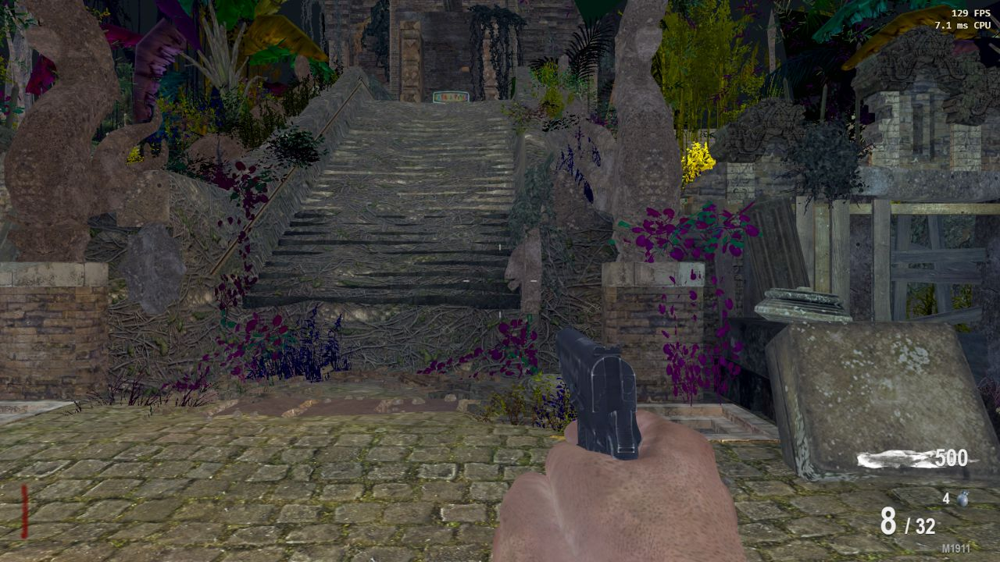

# CoD Zombies Web

A browser runtime for **Call of Duty Zombies**. It loads the original maps, models, textures, lighting, animations, sounds and HUD art from **your own installed copies** of the games and plays them in a desktop browser with [three.js](https://threejs.org/).


> **Unofficial fan project.** Not affiliated with or endorsed by Activision, Treyarch or Infinity Ward. **No game assets are included in this repository.** You need legally owned copies of the games and map DLC; the tools extract assets from your installation into a local, git-ignored folder.

---

## Contents

- [Maps](#maps)
- [Shared features](#shared-features)
- [Map feature status](#map-feature-status)
- [Screenshots](#screenshots)
- [Requirements](#requirements)
- [Setup](#setup)
- [Playing](#playing)
- [Development](#development)
- [How it works](#how-it-works)
- [Credits and licences](#credits-and-licences)

**Legend:** ✅ working · ✅\* working, simplified or approximate · ❌ not implemented yet · — not part of the original map

---

## Maps

| Game | Map | Playable | Original loading movie | Co-op tested | Status |
|:--|:--|:--:|:--:|:--:|:--|
| World at War | Nacht der Untoten | ✅ | ✅ | ✅ | Complete survival |
| World at War | Verrückt | ✅ | ✅ | ❌ | Survival, traps and power |
| World at War | Shi No Numa | ✅ | ✅ | ❌ | Survival, huts, Hellhounds |
| World at War | Der Riese | ✅ | ✅ | ✅ | Survival, teleporters, Pack-a-Punch |
| Black Ops | Kino der Toten | ✅ | ✅ | ✅ | Survival, teleporter, Pack-a-Punch |
| Black Ops | Five | ✅ | ✅ | ❌ | Survival, elevators, portals, Thief |
| Black Ops | Ascension | ✅ | ✅ | ❌ | Survival, landers, rocket |
| Black Ops | Call of the Dead | ✅ | ✅ | ❌ | Survival, George Romero |
| Black Ops | Shangri-La | ✅ | ✅ | ❌ | Survival, minecart, water slide |
| Black Ops | Moon | ✅ | ✅ | ❌ | Survival, low gravity, P.E.S. |
| Black Ops | Dead Ops Arcade | ✅ | ✅ | ❌ | All ten arenas, solo |
| Black Ops II | TranZit | ✅ | ❌ | ❌ | Survival, bus, buildables |
| Black Ops II | Nuketown Zombies | ✅ | ❌ | ❌ | Survival, falling perks |
| Black Ops II | Die Rise | ✅ | ✅ | ❌ | Survival, perk elevators, leapers |
| Black Ops II | Buried | ✅ | ✅ | ❌ | Survival, Arthur, buildables |
| Black Ops II | Origins | ✅ | ✅ | ❌ | Early build: generators, staffs, Panzer |
| Infinite Warfare | Spaceland | ✅\* | ✅ | ❌ | Early solo survival test |
| Black Ops II | Mob of the Dead | ❌ | ❌ | ❌ | In development |

TranZit and Nuketown have no loading movie in the installed game; they show their original menu art with the map's music instead.

---

## Shared features

| Feature | Status | Notes |
|:--|:--:|:--|
| Original maps, models, textures and baked lighting | ✅ | Loaded from your install |
| Original sounds, music and character voices | ✅ | 3D positional audio |
| Original zombie AI, spawning and round scaling | ✅ | Ported by hand from the game scripts |
| Barriers: tear down, rebuild, climb through | ✅ | |
| Wall buys and Mystery Box | ✅ | Teddy bear and moving box |
| Perks and Pack-a-Punch | ✅ | Per-map machines and rules |
| Power-ups | ✅ | Max Ammo, Insta-Kill, Double Points, Nuke, Carpenter, Fire Sale |
| Weapons: recoil, spread, penetration, range falloff | ✅ | From the original weapon files |
| Grenades: cooking and throwing back | ✅ | |
| Knife lunge | ✅ | |
| Ragdolls, headshot gibs and blood | ✅ | |
| Crouch, prone and dolphin dive | ✅ | Dive on Black Ops maps only |
| Original menus with menu sounds and music | ✅ | WaW lobby, BO1 interrogation room, BO2 globe |
| Lobbies with invite links | ✅ | Up to 4 players |
| Online co-op | ✅ | Host runs the match; last stand and revives |
| Named server saves | ✅ | Three slots per map, shared across devices |
| Controller support | ✅ | Xbox, PlayStation, Nintendo and generic pads |
| Rebindable keys and settings | ✅ | |
| Testing mod menu | ✅ | God mode, points, ammo, noclip, weapon and round select |
| Easter egg quests | ❌ | None of the main quests yet |
| Monkey Bombs, Claymores, Bouncing Betties | ❌ | |
| Ballistic knife and dual-wield pistols | ❌ | |

---

## Map feature status

### World at War

| Feature | Nacht | Verrückt | Shi No Numa | Der Riese |
|:--|:--:|:--:|:--:|:--:|
| Rounds, barriers and zombie AI | ✅ | ✅ | ✅ | ✅ |
| Doors and zones | — | ✅ | ✅ | ✅ |
| Power switch | — | ✅ | — | ✅ |
| Perks | — | ✅ | ✅ | ✅ |
| Randomized perk huts | — | — | ✅ | — |
| Mystery Box | ✅ | ✅ | ✅ | ✅ |
| Ray Gun | ❌ | ❌ | ✅ | ❌ |
| Wunderwaffe DG-2 | — | — | ✅ | ❌ |
| Hellhound rounds | — | — | ✅ | ❌ |
| Electric traps | — | ✅ | ✅ | ❌ |
| Flogger | — | — | ✅ | — |
| Zipline | — | — | ✅ | — |
| Teleporters | — | — | — | ✅ |
| Pack-a-Punch | — | — | — | ✅ |
| Monkey Bombs | — | — | — | ❌ |
| Bouncing Betties | ❌ | ❌ | ❌ | ❌ |
| Easter eggs | ❌ | ❌ | ❌ | ❌ |

### Black Ops

| Feature | Kino | Five | Ascension | Call of the Dead | Shangri-La | Moon |
|:--|:--:|:--:|:--:|:--:|:--:|:--:|
| Rounds, barriers and zombie AI | ✅ | ✅ | ✅ | ✅ | ✅ | ✅ |
| Power, doors and perks | ✅ | ✅ | ✅ | ✅ | ✅ | ✅ |
| Pack-a-Punch | ✅ | ✅ | ✅ | ✅ | ✅ | ✅ |
| Mystery Box | ✅ | ✅ | ✅ | ✅ | ✅ | ✅ |
| Wonder weapon | ✅\* Thundergun | ✅\* Winter's Howl | ❌ Gersh Device | ✅\* V-R11 | ✅ 31-79 JGb215 | ✅ Wave Gun |
| Map transport | ✅ Teleporter | ✅ Elevators and portals | ✅ Lunar landers | ✅\* Ziplines and flinger | ✅\* Minecart and water slide | ✅ Teleporter and jump pads |
| Special enemy | ❌ Hellhounds | ✅\* Pentagon Thief | ❌ Space monkeys | ✅\* George Romero | ✅ Napalm and Shrieker | ✅ Astronaut |
| Crawlers | ❌ | ✅\* | — | — | — | ✅\* |
| Traps | ❌ | ✅\* | ❌ | — | ❌ | — |
| Map-specific mechanics | — | ✅ DEFCON | ✅ Rocket launch | ✅ Lighthouse PaP | ✅ Pressure plates | ✅ Oxygen, P.E.S., Hacker, excavators |
| Easter egg | ❌ | ❌ | ❌ | ❌ | ❌ | ❌ |

**Dead Ops Arcade:** all ten arenas ✅ · seven arcade weapons ✅ · fates and Room of Fate ✅\* · Cosmic Silverback ✅\* · co-op ❌ · bonus rooms ❌

### Black Ops II

| Feature | TranZit | Nuketown | Die Rise | Buried | Origins |
|:--|:--:|:--:|:--:|:--:|:--:|
| Rounds, barriers and zombie AI | ✅ | ✅ | ✅ | ✅ | ✅ |
| Doors and zones | ✅ | ✅ | ✅ | ✅ | ✅ |
| Power | ✅ Buildable switch | — Always on | ✅ | ✅ | ✅ Generators |
| Perks | ✅ | ✅ Fall from the sky | ✅ Ride the elevators | ✅ | ✅ |
| Pack-a-Punch | ✅ | ✅ | ✅ | ✅ | ✅ |
| Mystery Box | ✅ | ✅ | ✅ | ✅ | ✅ |
| Fire Sale | ✅ | ✅ | ✅ | ❌ | ✅ |
| Buildables | ✅ Turbine, shield, turret, trap, bus parts | — | ✅ Trample Steam, Sliquifier | ✅ Turbine, Trample Steam, Head Chopper, Resonator | ✅\* Staffs |
| Wonder weapon | ❌ Jet Gun | — | ✅ Sliquifier | ✅ Paralyzer | ✅\* Elemental staffs |
| Map transport | ✅ Bus | — | ✅ Elevators and escape pod | — | ✅ Crazy Place portals |
| Special enemy | ✅\* Denizens and Avogadro | — | ✅\* Leapers | ✅\* Ghosts | ✅\* Panzer Soldat |
| Map-specific mechanics | ✅ Fog and lava | ✅ Population sign, blue eyes | ✅ Elevator key | ✅ Arthur, chalks | ✅ Mud, digging, records |
| Who's Who / Tombstone | ❌ Tombstone | — | ✅\* Who's Who | — | — |
| Bank and weapon locker | ✅ | — | ❌ | ✅ | — |
| Giant robots and tank | — | — | — | — | ❌ |
| Easter egg | ❌ | ❌ | ❌ | ❌ | ❌ |

### Infinite Warfare: Spaceland (early test)

| Feature | Status |
|:--|:--:|
| Native world, sky, characters and zombies | ✅ |
| Original health, spawn-count and movement formulas | ✅ |
| Kendall 44 and M1 with native stats | ✅ |
| Wall buy, melee, reload, card gesture | ✅ |
| Baked lighting | ❌ |
| Perks, gates and rides | ❌ |
| Special enemies and clown waves | ❌ |
| Full weapon roster and grenades | ❌ |
| Co-op and server saves | ❌ |

Detailed notes for every map, including the exact script behaviour, approximations and test coverage, are in [docs/map-notes.md](docs/map-notes.md).

---

## Screenshots

| | |
|---|---|
|  |  |
| **Zombies lobby** with the original map art and font | **Der Riese mainframe**, with the testing mod menu open |
|  |  |
| **Zombie climbing through a window** after tearing off the boards | **Grenade explosion** with the original effects |
|  |  |
| **Shangri-La** | **The WaW-style pause menu** |

---

## Requirements

| Software | Notes |
|:--|:--|
| **Windows 10/11** | The extraction tools and helper scripts are Windows-specific |
| **The games you want to play** | World at War, Black Ops, Black Ops II and/or Infinite Warfare, with their map DLC |
| **Node.js** | Runs the server and tests. Developed with 25.9 |
| **Python 3** | Extraction and preparation. Tested with 3.14; Spaceland also needs NumPy, Pillow and lz4 |
| **FFmpeg** | On `PATH`. Converts audio, images and loading movies |
| **Git** | Fetches the OpenAssetTools source |
| **Visual Studio Build Tools 2026** | C++ desktop workload, to build the custom asset exporter |
| **A desktop browser** | Chrome, Edge or Firefox |
| **Disk space** | Several GB per game for extracted assets and caches |

---

## Setup

> The scripts default to games under `E:\SteamLibrary\steamapps\common\`. `extract_game.py` and `prepare_gameplay.py` accept `--game-dir`; other extractors use a `GAME` constant near the top, so edit it if your games live elsewhere. `.npmrc` pins npm's cache to this project's folder; change or remove its `cache=` line on another machine.

**1. Clone the repository**

```bash
git clone https://github.com/CallMeBrado/cod-zombies-web.git
```

**2. Download the tools** (Premake, OpenAssetTools and its patched source, npm dependencies)

```powershell
powershell -ExecutionPolicy Bypass -File tools\setup_tools.ps1
```

**3. Patch and build the asset exporter**

```powershell
python -B tools\extend_bo1_exporter.py
python -B tools\extend_bo2_exporter.py
powershell -ExecutionPolicy Bypass -File tools\build_exporter.ps1
```

Some maps need an extra patch before building: `extend_doa_exporter.py` (Dead Ops), `extend_five_exporter.py` (Five) and `extend_origins_exporter.py` (Origins).

**4. Extract and prepare the maps you own**

Nacht der Untoten:

```powershell
python -B tools\extract_game.py --game-dir "D:\Games\Call of Duty World at War"
```

Every other map has its own commands:

| Map | Extract | Prepare | Test |
|:--|:--|:--|:--|
| Verrückt | `npm run extract:verruckt` | `npm run prepare:verruckt` | `npm run test:verruckt` |
| Shi No Numa | `npm run extract:shi-no-numa` | `npm run prepare:shi-no-numa` | `npm run test:shi-no-numa` |
| Der Riese | manual, see [map notes](docs/map-notes.md) | `npm run prepare:map` | `npm run test:der-riese` |
| Kino der Toten | `python -B tools\extract_bo1.py` | `npm run prepare:bo1` | `npm run test:bo1` |
| Five | `npm run extract:five` | `npm run prepare:five` | `npm run test:five` |
| Ascension | `npm run extract:ascension` | `npm run prepare:ascension` | `npm run test:ascension` |
| Call of the Dead | `npm run extract:cotd` | `npm run prepare:cotd` | `npm run test:cotd` |
| Shangri-La | `npm run extract:shangri-la` | `npm run prepare:shangri-la` | `npm run test:shangri-la` |
| Moon | `npm run extract:moon` | `npm run prepare:moon` | `npm run test:moon` |
| Dead Ops Arcade | `npm run extract:doa` | `npm run prepare:doa` | `npm run test:doa` |
| Buried | `python -B tools\extract_bo2.py` | `npm run prepare:bo2` | `npm run test:bo2` |
| TranZit | `npm run extract:tranzit` | `npm run prepare:tranzit` | `npm run test:tranzit` |
| Nuketown Zombies | `npm run extract:nuketown` | `npm run prepare:nuketown` | `npm run test:nuketown` |
| Die Rise | `npm run extract:die-rise` | `npm run prepare:die-rise` | `npm run test:die-rise` |
| Origins | `npm run extract:origins` | `npm run prepare:origins` | `npm run test:origins` |
| Spaceland | see [map notes](docs/map-notes.md) | `npm run prepare:spaceland` | `npm run test:spaceland` |

Kino and Buried also provide the shared Black Ops and Black Ops II assets, so prepare them before the other maps of their game. `npm run prepare:menus` builds the original menus.

**5. Start the server**

```powershell
npm start
```

Open **http://127.0.0.1:8789** and pick a game. On Windows you can double-click **`Play Zombies.cmd`** instead. Each map downloads its asset pack once when you press Start Game (roughly 100–700 MB compressed) and is cached after that.

---

## Playing

Choose **SELECT MAP**, pick a map, then **START GAME**. Every binding can be changed under **Esc → Options → Controls**.

| Action | Keyboard and mouse | Controller |
|:--|:--|:--|
| Move | W A S D | Left stick |
| Look | Mouse (arrow keys also work) | Right stick |
| Fire / aim | Left / right mouse (F fires, X toggles aim) | RT / LT |
| Sprint / jump | Shift / Space | L3 / A |
| Crouch / prone / dive | C / Ctrl (Ctrl while sprinting dives) | B tap / B hold |
| Reload | R | X |
| Knife | V | R3 |
| Grenade | G (hold to cook) | RB |
| Switch weapon | Q or mouse wheel | Y |
| Use, buy, rebuild | E (hold to rebuild a window) | X (hold) |
| Place equipment | 5 | D-pad up |
| Pause and mod menu | Esc | Menu |

**Local network:** the server listens on port **8789** on all interfaces, so other PCs can open `http://<this-PC's-address>:8789/`. Set `HOST=127.0.0.1` to allow only this PC, or `PORT=9000` for another port. Controllers on other devices need HTTPS or `localhost`.

**Co-op:** every browser starts in its own private lobby. Use **INVITE A FRIEND** to copy a join link, or **JOIN** another lobby on the same map. The host starts the game.

**Saves:** Pause → **SAVE GAME** stores the match in one of three named slots under `local-data/saves/`, shared by every device that can reach the server.

---

## Development

```bash
npm test                 # Full shared suite
npm run test:coop        # Host and guest games through the relay
npm run test:lobby       # Lobbies, invites, host-only start
npm run test:controllers # Input, menus and analog movement at 30–240 FPS
npm run test:movement    # Stances, low cover and dives
npm run prepare:map      # Rebuild packs and zombie navigation
```

When adding a map, run its own test, the shared suite, and then check it in the browser: loading, starting a round, movement, firing and reloading, spawning and the map's own interactions.

| Folder | Contents |
|:--|:--|
| `web/` | Browser runtime: rendering, game rules, AI, HUD, menus, audio |
| `tools/` | Extraction, preparation, server and test scripts |
| `docs/` | Screenshots, [map notes](docs/map-notes.md) and the [development log](docs/development-log.md) |
| `local-data/` | Extracted game data. Git-ignored; never commit or share it |

---

## How it works

1. **Extraction:** a patched [OpenAssetTools](https://github.com/Laupetin/OpenAssetTools) exporter reads the games' fastfiles and archives and writes maps, collision, models, animations, effects, sounds and textures into `local-data/`. Spaceland uses [Cordycep](https://github.com/Scobalula/Cordycep) instead.
2. **Preparation:** Python scripts read the original map entities and decompiled zombie scripts and produce gameplay manifests: weapons, rounds, spawners, barriers, perks and map mechanics.
3. **Packing:** `build_preload.mjs` bundles each map into compressed, cacheable packs and precomputes zombie navigation.
4. **Runtime:** the browser renders the map with three.js using the original lightmaps and runs a fixed 120 Hz simulation. The original game scripts are not executed; their rules, numbers and timings are ported by hand and checked against the extracted scripts.

---

## Credits and licences

- **Call of Duty** and all its assets belong to Activision, Treyarch and Infinity Ward. This project does not distribute them.
- **[OpenAssetTools](https://github.com/Laupetin/OpenAssetTools)** is GPL-3.0. The exporter patch in `tools/oat-web-world.patch` is also GPL-3.0 (see `tools/OAT-PATCH-LICENSE`).
- **[three.js](https://github.com/mrdoob/three.js)** is MIT licensed.
- Spaceland decoding follows [Greyhound](https://github.com/Scobalula/Greyhound) and [iw7-mod](https://github.com/auroramod/iw7-mod); scripts are decompiled with [gsc-tool](https://github.com/xensik/gsc-tool).
